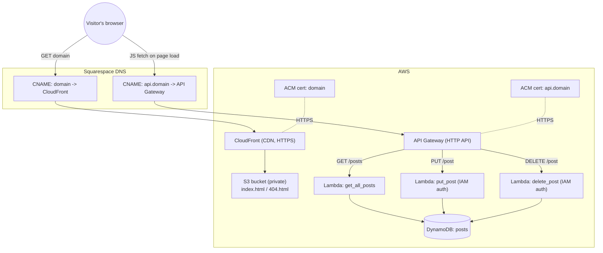

# Cloud Resume Challenge — AWS Blog

A small serverless blog built on AWS, entirely provisioned with Terraform. This project is my take on the [Cloud Resume Challenge (AWS track)](https://cloudresumechallenge.dev/docs/the-challenge/aws/) — a personal/learning project built to get my own page online and get hands-on experience with cloud infrastructure.

## Architecture

The site is a static two-page frontend backed by a small serverless API:

- **Frontend** — `index.html` (lists all blog posts, served at the root path) and `404.html` (served for any other path). Both are static files stored in a private **S3** bucket and distributed through **CloudFront**. CloudFront keeps the bucket private, terminates HTTPS, and caches/optimizes static asset delivery.
- **Data storage** — posts are stored in **DynamoDB**, a managed NoSQL database. For the expected volume (up to ~1000 posts) it's inexpensive and provides everything needed, without paying for an always-on instance the way a PostgreSQL setup on RDS would require.
- **API layer** — **API Gateway** (HTTP API) in front of three Python **Lambda** functions:
  - `GET /posts` → `get_all_posts` — public, used by the frontend to render the post list
  - `PUT /post` → `put_post` — protected with **AWS IAM** authorization
  - `DELETE /post` → `delete_post` — protected with **AWS IAM** authorization

  IAM authorization is enough here since only the author manages posts. If the blog ever needed to support multiple registered users, OIDC-based authorization would be the better fit.
- **Frontend ↔ API** — `index.html` includes JavaScript that calls the API on page load to fetch all posts from DynamoDB and render them.
- **TLS & DNS** — certificates for both the site and the API are issued through **ACM**. The domain is registered in Squarespace (an existing domain, kept there instead of moving to Route 53) with CNAME records pointing at the AWS endpoints.



## Project structure

```
.
├── api/            # Lambda source code
│   ├── get_all_posts.py
│   ├── put_post.py
│   ├── delete_post.py
│   └── requirements.txt
├── infra/          # Terraform configuration
│   ├── main.tf                 # providers, backend, locals
│   ├── variables.tf
│   ├── output.tf
│   ├── s3.tf                   # website bucket + objects
│   ├── cloudfront.tf           # CDN + origin access control
│   ├── acm_certificate.tf      # TLS certs for site and API
│   ├── apigateway.tf           # HTTP API, routes, IAM auth
│   ├── lambda.tf                # Lambda functions
│   ├── layer.tf                # Lambda layer (pydantic, etc.)
│   ├── role.tf / policy.tf     # IAM roles & policies
│   └── terraform.tfvars.example
├── website/        # Static frontend (index.html, 404.html, favicons)
└── dist/           # Build output for Lambda/layer packaging (generated)
```

## Tech stack

- **Terraform** — infrastructure as code
- **AWS S3 + CloudFront** — static site hosting and CDN
- **AWS DynamoDB** — post storage
- **AWS Lambda (Python) + API Gateway (HTTP API)** — backend API, secured with IAM auth on write/delete routes
- **AWS ACM** — TLS certificates
- **Squarespace DNS** — domain and CNAME records
- **pydantic**, **boto3** — used inside the Lambda functions

## Deployment

1. Copy `infra/terraform.tfvars.example` to `infra/terraform.tfvars` and set your own `domain_name` (and `create_api_domain` once the API's ACM certificate is validated).
2. Build the Lambda/layer artifacts into `dist/` (packaging step — see the roadmap below for automating this via CI/CD).
3. From `infra/`, run:
   ```bash
   terraform init
   terraform plan
   terraform apply
   ```
4. Add the DNS records Terraform outputs (`certificate_validation_records`, `cloudfront_domain_name`, `api_gateway_domain_name`) in your DNS provider to validate the ACM certificates and point the domain/API subdomain at AWS.

## API

| Method | Path      | Lambda            | Auth     |
|--------|-----------|--------------------|----------|
| GET    | `/posts`  | `get_all_posts`    | Public   |
| PUT    | `/post`   | `put_post`         | AWS IAM  |
| DELETE | `/post`   | `delete_post`      | AWS IAM  |

## Roadmap

- [ ] Add Python tests (proper `src` layout; tests should not end up bundled into the Lambda packages)
  - [ ] Run tests in CI/CD
- [ ] Add `mypy` and `ruff`
  - [ ] Run them in CI/CD
- [ ] Split artifact building into its own CI/CD job(s)
- [ ] Set up CI/CD for the whole project (build → test/lint → deploy via Terraform)

## About

This is a personal learning project built for the [Cloud Resume Challenge](https://cloudresumechallenge.dev/docs/the-challenge/aws/)
